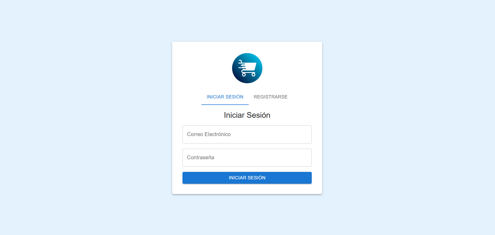
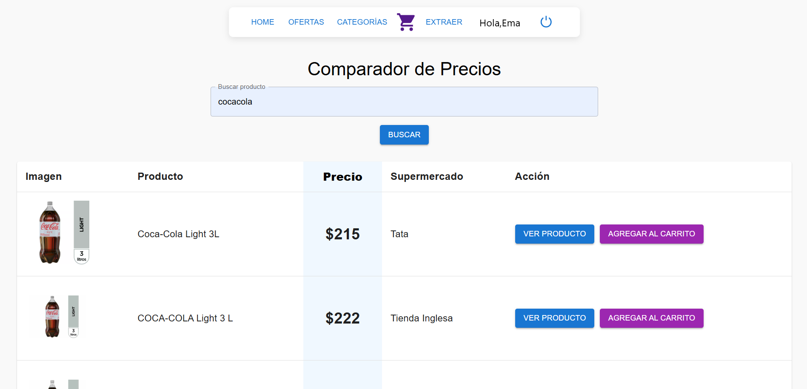
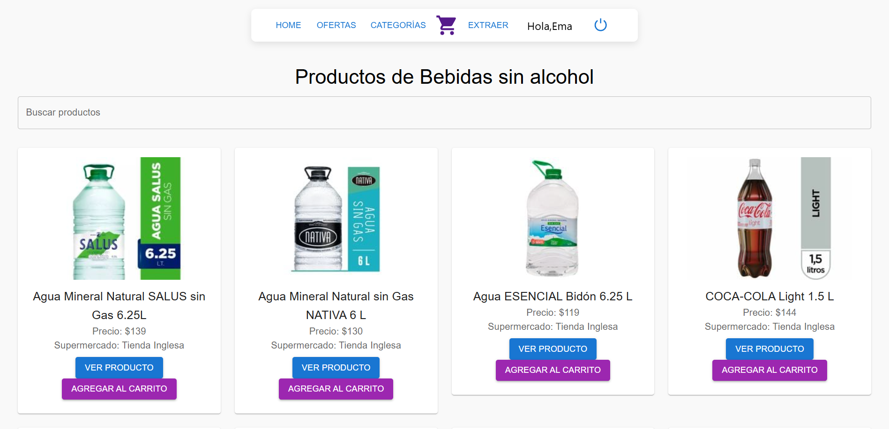
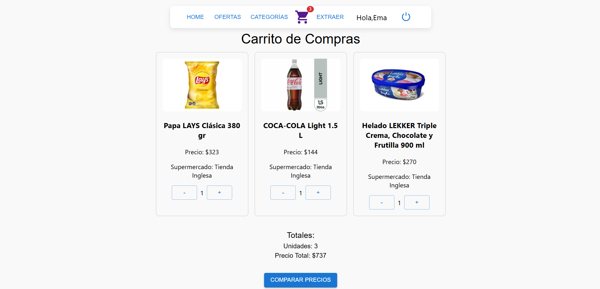
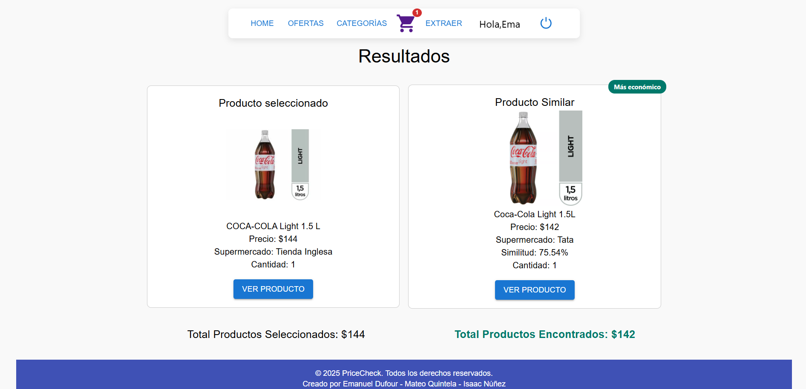
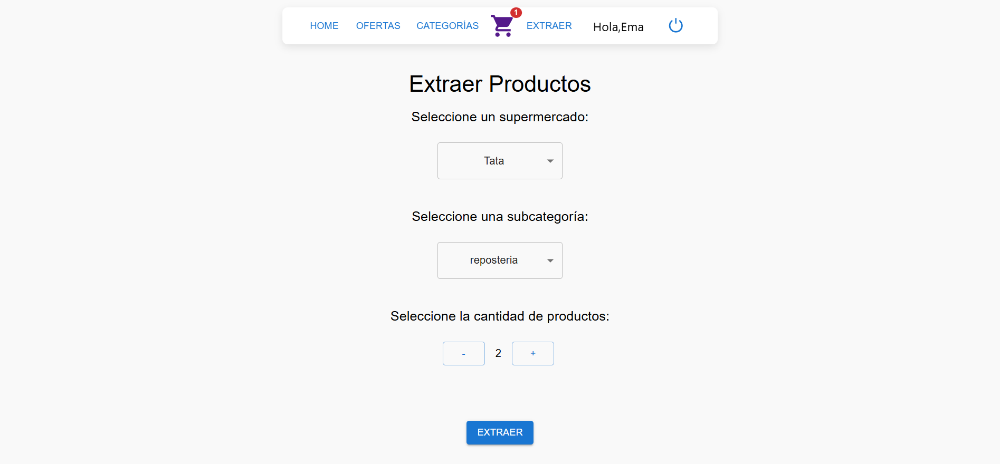
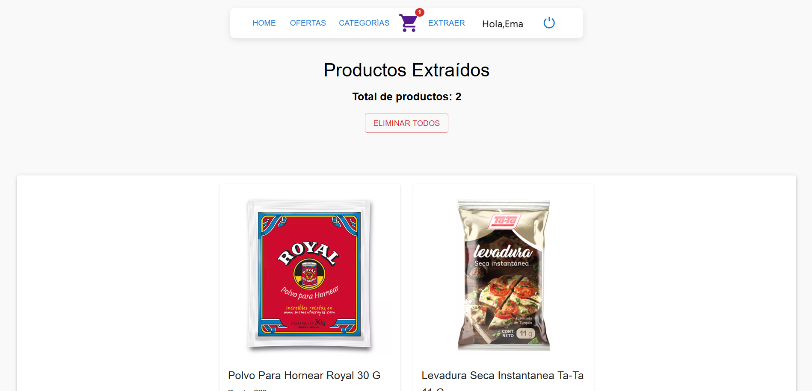
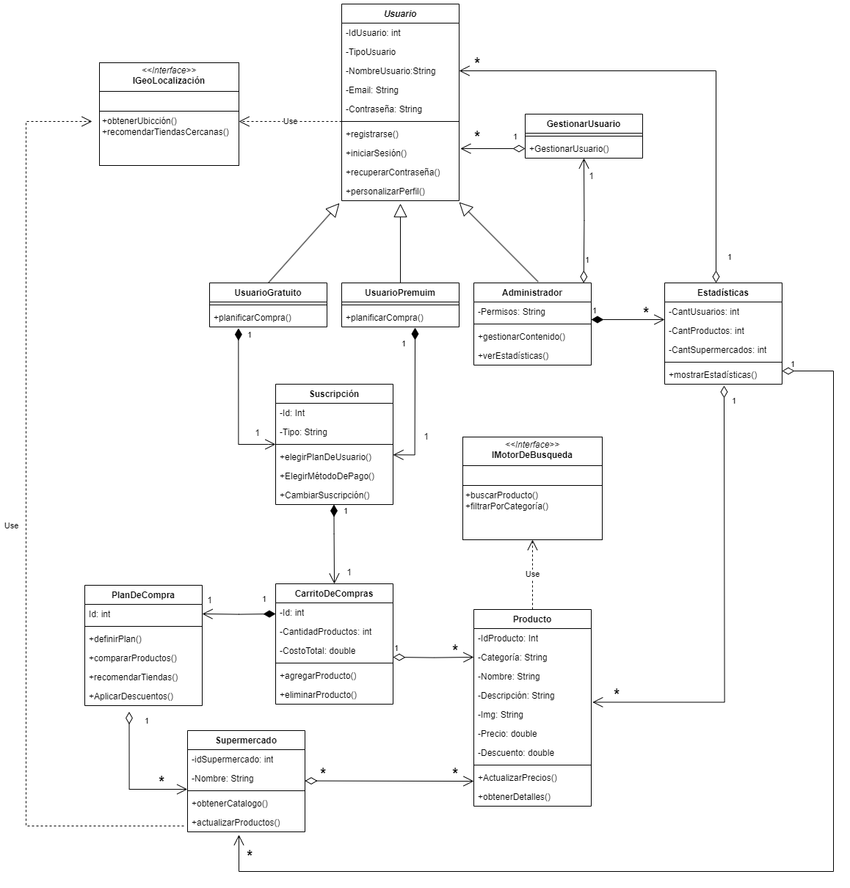

# Price Check

Price Check es una aplicación Web que le permite a los usuarios realizar búsquedas online de productos y comparar precios en diferentes supermercados y sitios de e-commerce. 

##  Características principales
- Extracción de Productos: Esta aplicación extrae la información de los sitios webs de los supermercados y la recopila en una base de datos, esta información es utilizada posteriormente para la comparación de precios y productos. 
- Motor de búsqueda: La aplicación permite realizar búsquedas ingresando el nombre o las propiedades de los productos  directamente en la barra de búsqueda.
- Categorías: Agrupa los productos extraidos en categorías, esto le permite a los usarios hacer búsquedas más exactas al aplicar filtros  como por ejemplo:
Lácteos, frutas, verduras, carnes, productos de limpieza, etc.
- Carrito de Compras Inteligente: El sistema cuenta con un carrito de compras, el cual compara los productos agregados con productos disponibles en otros supermercados, hace una evalución de los precios y recomienda la opción más económica.

## Capturas

## Principales tecnologías utilizadas
Lenguajes de programación: 
- Python
- JavaScript

Frameworks y otras herramientas:
- Node.js
- React (CRA)
- PostgreSQL
- Selenium
- BeautifulSoup
- Node-fetch
- Sharp
- Resemblejs
- String-simility
- Google Chrome
- Toggle JavaScript
  
## Estructura del Proyecto

  
## Mejoras a implementar
En la siguiente fase del proyecto se implementarán las siguientes actualizaciones:
- Sistemas de pago.
- Subscripciones premium y gratuitas.
- Extracción y actualización automática de productos.
- Notificaciones de cambios de precios.
- Integración con más tiendas online.
- Versión mobile optimizada.

## Colaboradores 
Este proyecto fue realizado en colaboración con Emanuel Defour y Mateo Quintela, como un proyecto prototipo solicitado por la empresa de software PHI IT.
### 

